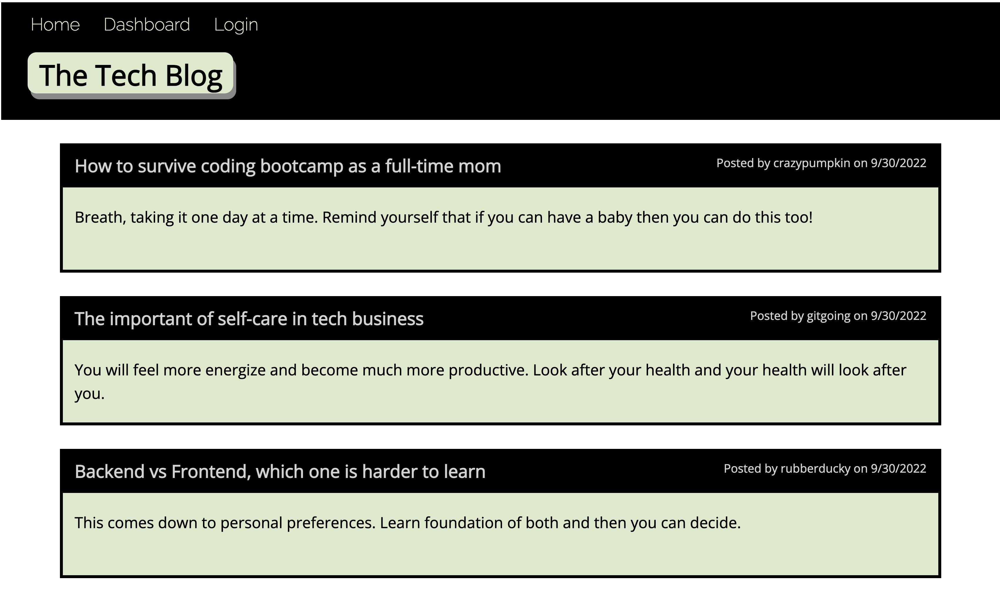
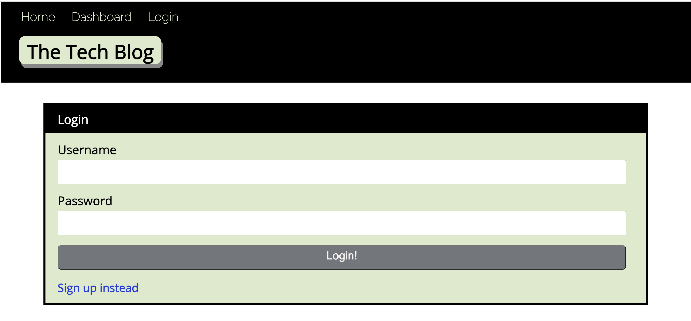
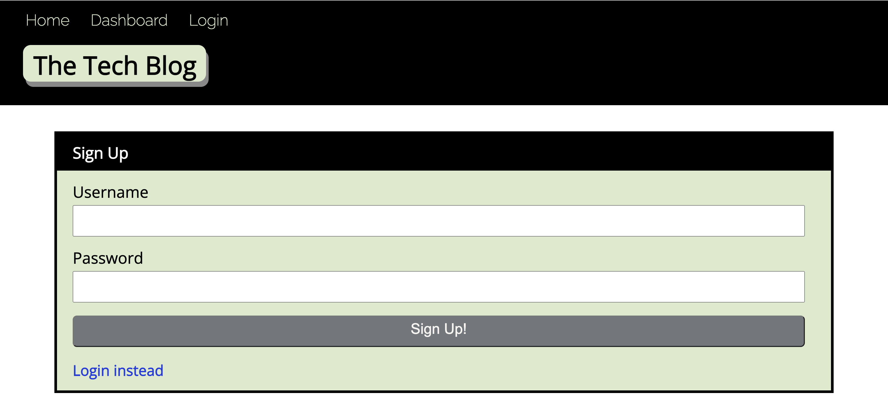
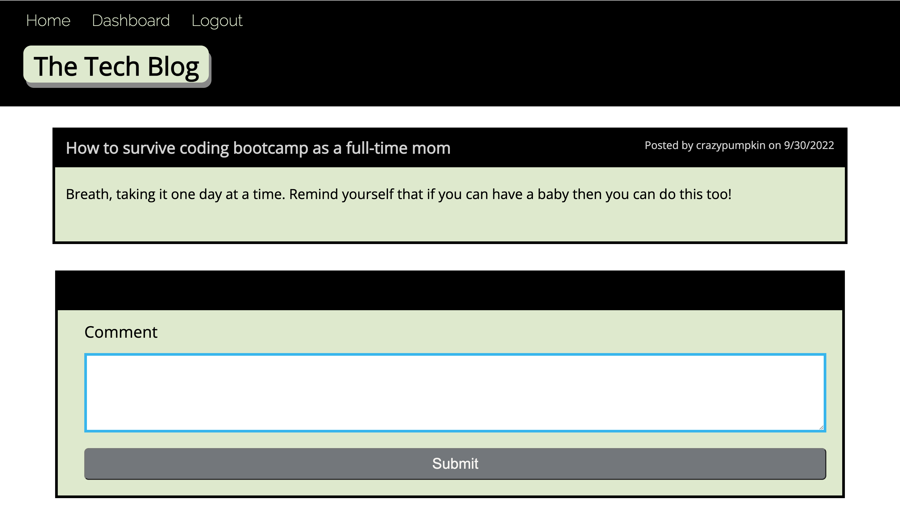

# Tech-Blog
CMS-style blog site. 

## Table of Contents
1. [Descriptions](#descriptions)
2. [Installations](#installations)
3. [Usage](#usage)
4. [Tech Use](#techUse)
5. [Contributing](#contributing)
6. [Visuals](#visuals)
7. [Link](#link)

## Descriptions
This tech-blog site is following the Model-View-Controller paradigm and using modularization approach. 

Modular programming is a software design technique that emphasizes separating the functionality of a program into independent, interchangeable modules, such that each contains everything necessary to execute only one aspect of the desired functionality.(https://en.wikipedia.org/wiki/Modular_programming)


## Installations 

To implement Handlebars.js for the Views folder
```pip
  npm install express-handlebars
```

To connect to a MySQL database for the Models, and create and Express.js API for the Controllers.
```pip
  npm install mysql2

  npm install sequelize
```

To use environment variables
```pip
  npm install dotenv --save
```

To hash passwords
```pip
  npm install bcrypt
```

To add authentication
```pip
  npm install express-session

  npm install connect-session-sequelize
```

## Tech Use
* Handlebars.js : is a template engin that makes it easy to separate HTML from the code that powers it. (https://sabe.io/tutorials/getting-started-with-handlebars-js)

* CSS

* JavaScript

* express-handlebars 

* MySQL2

* Sequelize

* bcrypt

* dotenv

* express-session

* connect-session-sequelize


## Contributing
* My instructor, Mr.Anthony Cooper

* Slack Learning Support Team

## Visuals

Homepage displaying the existing posts with the name of users and posted date.



Login Page for user to be able to access the blogs.



User can sign up to create an account.



User will be able to access the posts and leave comments after logged in successfully.



## Links

[Heroku](https://obscure-eyrie-14613.herokuapp.com/)
